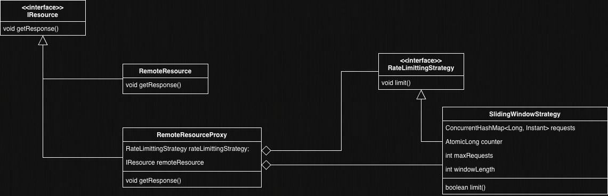

# Sliding Window And Fixed Window Rate Limiter

A Java implementation of a **Sliding Window Rate Limiter** using the **Proxy** and **Strategy** design patterns. Built for Low-Level Design (LLD) practice.

---


## UML Diagram



---

## Setup Process

### Prerequisites
- Java 17+
- Maven

### Steps

1. **Clone the repository**
   ```bash
   git clone https://github.com/akshat-code21/rate_limiter_lld_impl
   cd rate-limiter
   ```

2. **Build the project**
   ```bash
   mvn clean install
   ```

3. **Run the application**
   ```bash
   mvn exec:java -Dexec.mainClass="org.example.Main"
   ```

### Configuration

In `Main.java`, adjust the rate limiter parameters:

```java
new SlidingWindowStrategy(maxRequests, windowLengthSeconds, resource);
```

| Parameter            | Description                                      | Example |
|----------------------|--------------------------------------------------|---------|
| `maxRequests`        | Max requests allowed within the time window      | `3`     |
| `windowLengthSeconds`| Duration of the sliding window in seconds        | `4`     |
| `resource`           | The `IResource` instance to proxy               | `new RemoteResource()` |

---

### Design Patterns Used

- **Proxy Pattern** — `RemoteResourceProxy` intercepts calls to `IResource` and enforces rate limiting before delegating to `RemoteResource`.
- **Strategy Pattern** — `RateLimittingStrategy` is an interface, allowing different algorithms (e.g., fixed window, token bucket) to be swapped in without changing the proxy.

---

## Sample Interaction

Configuration: `maxRequests = 3`, `windowLength = 4s`, one request per second.

```
t=1s  → Remote Resource says hi      ✅  (window: 1 request)
t=2s  → Remote Resource says hi      ✅  (window: 2 requests)
t=3s  → Remote Resource says hi      ✅  (window: 3 requests)
t=4s  → 429 Too Many Requests        ❌  (window full — t=1s not yet expired)
t=5s  → Remote Resource says hi      ✅  (t=1s slides out, window: 3 → 2 → 3)
t=6s  → Remote Resource says hi      ✅  (t=2s slides out)
t=7s  → Remote Resource says hi      ✅  (t=3s slides out)
t=8s  → 429 Too Many Requests        ❌  (window full again)
t=9s  → Remote Resource says hi      ✅  (t=5s slides out)
t=10s → Remote Resource says hi      ✅  (t=6s slides out)
```

---

## Project Structure

```
src/
└── main/
    └── java/
        └── org/
            └── example/
                ├── Main.java
                ├── proxy/
                │   └── RemoteResourceProxy.java
                ├── resource/
                │   ├── IResource.java
                │   └── RemoteResource.java
                └── strategy/
                    ├── RateLimittingStrategy.java
                    └── SlidingWindowStrategy.java
```